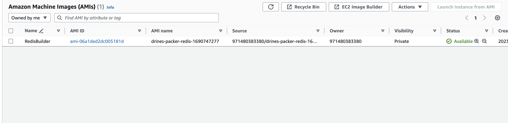
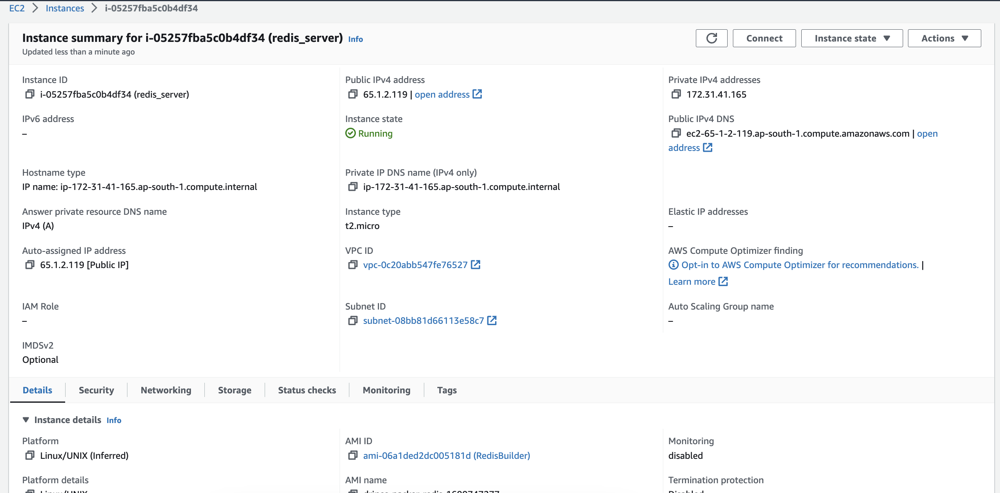
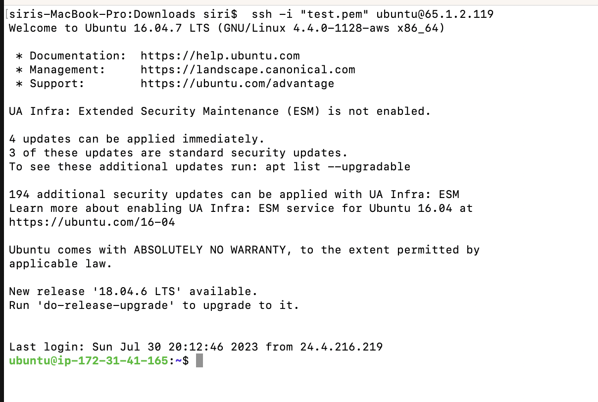
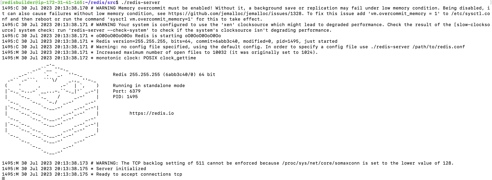

# Redis AMI builder using Packer

This repository contains a simple example of using Packer to create an Amazon Machine Image (AMI) that runs Redis.

## Prerequisites

To build the AMI, follow the below steps:

- [Packer](https://developer.hashicorp.com/packer/downloads) installed on your local machine
- An AWS account
- Your AWS access credentials (AWS Access Key ID and Secret Access Key)
- [Git](https://git-scm.com/book/en/v2/Getting-Started-Installing-Git) installed on local machine

## Getting Started

1. Clone this repository to your local machine using Git:
   ```
   git clone git@github.com:sirishacyd/ami-to-build-redis.git
   ```
   
2. Navigate to the directory containing the repository:
   ```
   cd ami-to-build-redis.git
   ```

3. Set your AWS credentials as environment variables:
 
   ```
   export AWS_ACCESS_KEY=<your-aws-access-key>
   export AWS_SECRET_KEY=<your-aws-secret-key>
   export AWS_REGION=<aws-region> 
   ```

5. Validate the Packer template to make sure there are no errors:
   ```
   packer validate packer_template.json
   ```

6. If the template is valid, build the AMI using Packer:
   ```
   packer build packer_template.json
   ```

   - Packer will begin building the AMI. This may take a few minutes.

   - Once the build is complete, Packer will output the ID of the new AMI.

### Log File For the AMI image Built done by packer 
[LogFile](packer_build.log)
### AMI Built by Packer 
```

==> Wait completed after 6 minutes 53 seconds

==> Builds finished. The artifacts of successful builds are:
--> amazon-ebs: AMIs were created:
ap-south-1: ami-06a1ded2dc005181d

```

### Launching Instance with AMI that has redis built in using packer

### Loginng in to the Instance using AMI we have built
```
ssh -i "test.pem" ubuntu@65.1.2.119
```

### Running Redis Server
```
cd /home/redisbuilder/redis/src
./redis-server
```

